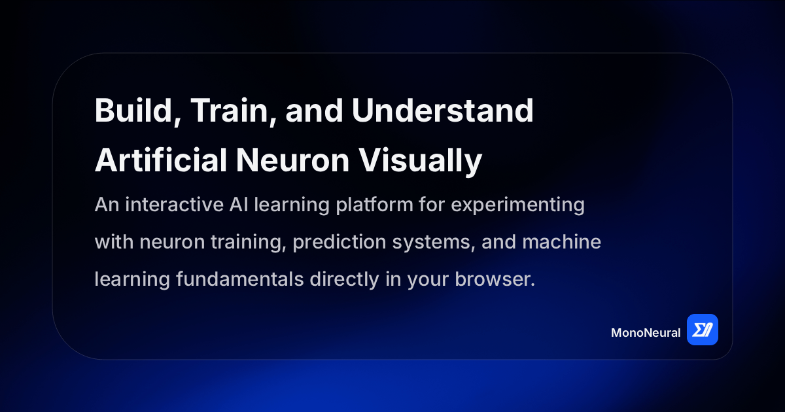

# MonoNeural

<p align="center">
  
</p>

<p align="center">
  Learn artificial intelligence from the ground up through interactive experimentation, real-time visualization, and structured learning examples.
</p>

<br>

<div align="center">
    <a href="https://mononeural.vercel.app" target="_blank" rel="noopener noreferrer">
        
    </a>
</div>

<br>

## Project Introduction

MonoNeural is an interactive learning platform designed to simplify the core concepts of artificial neural networks by transforming abstract mathematical ideas into a fully visual and hands-on experience.

Instead of requiring users to write code or manually implement mathematical formulas, MonoNeural provides a structured environment where users can directly construct artificial neurons, define inputs, configure weights and bias values, and observe how these parameters influence prediction behavior in real time.

The platform is designed with a strong focus on clarity and educational value. Every component inside MonoNeural is intentionally built to represent a core concept in machine learning, allowing users to gradually develop intuition about how neural computation works.

MonoNeural is not just a tool for experimentation. It is a guided learning environment that bridges the gap between theoretical machine learning concepts and practical understanding.

<br>

## The Problem

Modern learning resources for artificial intelligence often present neural networks in a highly abstract and technical format. While mathematically correct, these explanations can be difficult for beginners to interpret without strong programming or mathematical backgrounds.

Most learners encounter challenges such as:

Understanding how inputs, weights, and bias interact in a real system is often unclear when only equations are presented. The transformation from raw input data to a final prediction is typically hidden behind code implementations or mathematical notation, which reduces intuitive understanding.

Additionally, traditional learning environments tend to separate theory and practice. Users read about neural networks in one place and implement them in another, which creates a cognitive gap between understanding and application.

Another major challenge is the lack of real-time feedback during learning. Students often run static code examples or simulations without being able to observe how small parameter changes affect outcomes dynamically.

This creates a situation where learners can memorize concepts but struggle to develop true intuition about how neural computation behaves.

<br>

## The MonoNeural Approach

MonoNeural addresses these challenges by combining theoretical learning with interactive visualization inside a single unified platform.

Instead of treating neural networks as static mathematical formulas, MonoNeural represents them as live, configurable systems that respond immediately to user input.

Each neuron is treated as an interactive object where inputs, weights, and bias values can be modified dynamically. Users can directly observe how these changes affect the weighted sum, activation output, and final prediction result.

The platform also introduces a structured training and testing workflow that simulates how real machine learning systems operate. Users can define training criteria, adjust learning parameters, and visualize how the model evolves over time through parameter updates and performance changes.

By integrating visualization, interaction, and structured learning, MonoNeural transforms artificial neuron concepts into an intuitive learning experience that focuses on understanding rather than memorization.

<br>

## Purpose and Goals

The primary purpose of MonoNeural is to make the fundamental concepts of artificial neural networks accessible, intuitive, and interactive for learners at all levels. It is designed to remove the barrier between theoretical understanding and practical intuition by allowing users to directly engage with how a neuron behaves when its parameters change.

Unlike traditional learning tools that focus heavily on static explanations or code-driven implementations, MonoNeural focuses on experiential learning. The goal is to help users develop a mental model of how inputs, weights, bias, and activation functions work together to produce meaningful outputs.

One of the key goals of the platform is to encourage exploration. Users are not restricted to predefined scenarios but are instead given the freedom to construct their own neurons, define their own datasets, and observe how different configurations influence predictions. This promotes deeper understanding through experimentation rather than passive learning.

Another important goal is to reduce cognitive overload for beginners. Machine learning concepts often introduce multiple layers of abstraction at once, including linear algebra, calculus, and programming logic. MonoNeural abstracts these complexities into visual and interactive components so that users can focus on understanding behavior before diving into mathematical detail.

The platform also aims to bridge the gap between education and real-world machine learning workflows. By introducing structured training, testing, and evaluation flows, users can gradually understand how real models are built, optimized, and validated in practical systems.

Ultimately, MonoNeural is built to create intuition. The goal is not only to teach what a neural network is, but to help users understand how and why it behaves the way it does when parameters are adjusted.

<br>

## Features

MonoNeural provides a complete interactive environment that covers the full lifecycle of an artificial neuron, from creation and configuration to training, testing, and evaluation. Each feature is designed to represent a real concept in machine learning while remaining accessible to users without requiring programming knowledge.

The platform is structured around modular tools that work together to form a complete learning ecosystem. This includes a training environment for building and optimizing neurons, a testing environment for evaluating predictions, and a collection of pre-trained examples that demonstrate real-world use cases.

<br>

### 1. Artificial Neuron Trainer

The Artificial Neuron Trainer is the core learning component of MonoNeural. It allows users to construct a neuron from the ground up by defining inputs, assigning weights, and configuring bias values. This tool is designed to simulate how a neuron learns from data through iterative training cycles.

Users can define custom datasets that represent real-world scenarios, such as academic performance, financial eligibility, or behavioral prediction systems. Each dataset is processed through a training workflow where the neuron adjusts its internal parameters to minimize prediction error over time.

The trainer also provides real-time visualization of neuron behavior, allowing users to observe how input contributions are weighted and how the final activation output evolves during training. This makes abstract learning processes visible and understandable.

Explore: [Full Artificial Neuron Trainer Document](docs/trainer.md)

<br>

### 2. Artificial Neuron Tester

The Artificial Neuron Tester is designed to evaluate trained neurons using real or synthetic input data. It allows users to apply learned weights and bias values to new test cases and observe prediction outcomes instantly.

This tool also includes configurable prediction thresholds, enabling users to define meaningful interpretation layers over raw numerical outputs. For example, a numeric activation value can be translated into human-readable results such as Pass or Fail, Approved or Rejected, or Positive and Negative outcomes.

The tester helps users understand how trained models behave when exposed to unseen data, reinforcing the concept of generalization in machine learning.

Explore: [Full Artificial Neuron Tester Document](docs/tester.md)

<br>

### 3. Pre Trained Examples

MonoNeural includes a set of pre-trained neuron examples that demonstrate how artificial neurons can be applied to real-world decision-making scenarios. These examples are designed to provide immediate learning value without requiring users to build models from scratch.

Each example is fully configured with predefined weights, bias values, and test datasets, allowing users to directly observe prediction behavior and understand how different input conditions affect outcomes.

These examples cover scenarios such as academic performance prediction, financial decision modeling, behavioral analysis, and personal goal evaluation. They serve as practical demonstrations of how neural computation can be applied to structured decision systems.

Explore: [Full Pre-Trained Examples Document](docs/examples.md)

<br>

### 4. Documentation System

The documentation system provides a structured learning path that explains both theoretical concepts and practical usage of the platform. It is organized into progressive sections that guide users from basic neuron fundamentals to advanced training and testing workflows.

This system ensures that users can learn at their own pace while maintaining a clear understanding of how each component of MonoNeural contributes to the overall learning experience.

Explore: [Full Docs-System Document](docs/documentation.md)

<br>

## Technology Stack

MonoNeural is built using modern frontend technologies designed for performance, scalability, and a smooth interactive learning experience.

| Description            | Technology   | Logo                                                                        |
|------------------------|--------------|-----------------------------------------------------------------------------|
| Frontend Framework     | React        |      |
| Language               | TypeScript   |   |
| Build Tool             | Vite         |         |
| Styling Framework      | Tailwind CSS |  |
| UI Components          | shadcn/ui    |     |
| Animated UI Components | SmoothUI     |                               |
| Animated Background    | React Bits   |                              |
| Neuron Visualization   | React Flow   |                              |
| Routing                | React Router |  |

<br>

## Project Structure

MonoNeural follows a modular and feature-driven structure designed to keep the codebase clean, scalable, and easy to maintain. The architecture is organized in a way that separates UI concerns, business logic, reusable utilities, and application-level configuration.

This structure ensures that each part of the system has a clear responsibility, making it easier for developers to navigate, extend, and debug the application as it evolves.

| Directory        | Description                                                                                                                                                                                                 |
| ---------------- | ----------------------------------------------------------------------------------------------------------------------------------------------------------------------------------------------------------- |
| `src/`           | Contains the main application source code, including all core logic, pages, and components.                                                                                                                 |
| `components/`    | Reusable UI components used across multiple pages such as cards, tables, inputs, and visualization elements. These components are designed to be independent and composable.                                |
| `pages/`         | Route-level page components that represent full screens of the application such as Trainer, Tester, Examples, Documentation, and Home. Each page composes multiple components into a complete feature view. |
| `layout/`        | Global layout components responsible for application-wide structure and behavior, including routing wrappers, navigation handling, and shared UI regions.                                                   |
| `hooks/`         | Custom React hooks that encapsulate reusable logic such as neuron configuration handling, training state management, and prediction workflows.                                                              |
| `services/`      | Modules responsible for external interactions and internal service logic, including data processing and structured computation utilities.                                                                   |
| `query-options/` | Centralized configuration for data queries and structured data fetching logic used across the application.                                                                                                  |
| `constants/`     | Application-wide constant values such as default training parameters, configuration limits, and static UI settings.                                                                                         |
| `types/`         | TypeScript type definitions that define structured data models for neurons, training datasets, and prediction results.                                                                                      |
| `utils/`         | Utility functions used across the application, including normalization logic, activation calculations, and data transformation helpers.                                                                     |
| `assets/`        | Static assets such as images, icons, and logos used throughout the application.                                                                                                                             |


This structure is intentionally designed to support long-term scalability while maintaining clear separation of concerns across the entire MonoNeural platform.

<br>

## Environment Configuration

Environment variables are used in MonoNeural to manage external configurations and sensitive runtime values in a clean and secure way. This ensures that the application remains flexible across different environments such as local development, testing, and production deployment without requiring code changes.

A template file named `.env.example` is included in the repository. This file defines the expected structure of environment variables and acts as a reference for developers to understand what configuration values are required by the application.

Before running the project, developers should create a local `.env` file by copying the example file. This can be done using the following command:

```
cp .env.example .env
```

Once the `.env` file is created, it must be populated with the required configuration values needed for the application to function correctly. These values typically include API keys, service endpoints, and any other environment-specific settings required during runtime.

This approach ensures that sensitive information is never committed to the repository while still allowing the application to be fully configurable and production-ready.

<br>

## Installation

MonoNeural is designed as a modern frontend application, so the setup process is straightforward and optimized for developer experience. The project can be run locally with a few standard Node.js commands, making it easy for contributors and users to get started quickly.

To begin, the repository should be cloned from GitHub to the local development environment. This creates a local copy of the project that includes all source code, configuration files, and documentation.

```
git clone https://github.com/dulanjayabhanu/mononeural.git
```

After cloning the repository, navigate into the project directory. This step ensures that all subsequent commands are executed in the correct project context.

```
cd mononeural
```

Once inside the project directory, all required dependencies must be installed. These dependencies include React, build tools, UI libraries, and other packages required for the application to run properly.

```
npm install
```

After installation is complete, the development server can be started. This will launch the application locally and enable hot-reloading, allowing developers to see changes in real time.

```
npm run dev
```

Once the development server is running, the application will be accessible in the browser at the local development URL provided by Vite, typically `http://localhost:5173`.

This setup process ensures a smooth and consistent development experience across different environments.

<br>

## Production Build

MonoNeural includes a production-ready build process that optimizes the application for deployment. This process bundles the entire application into a highly optimized static output that can be hosted on any modern hosting platform.

The production build step compiles all TypeScript code, processes React components, and optimizes assets such as styles and static files. The result is a lightweight and efficient build that is suitable for production environments.

To generate a production build, the following command should be executed:

```
npm run build
```

Once the build process is complete, the output will be generated inside the `dist` directory. This directory contains all compiled and optimized files required to run the application in production.

After building the application, it is recommended to preview the production output locally before deployment. This helps ensure that the build behaves as expected in a production-like environment.

```
npm run preview
```

The preview server serves the contents of the `dist` directory and allows developers to verify that routing, assets, and application behavior are functioning correctly before publishing.

This build process ensures that MonoNeural can be reliably deployed to modern static hosting platforms while maintaining optimal performance and stability.

<br>

## Deployment

MonoNeural is designed as a static frontend application, which makes it highly compatible with modern hosting platforms. The deployment process is straightforward and focuses on serving the optimized production build generated from the project.

After running the production build command, the output is generated inside the `dist` directory. This directory contains all the compiled assets required to run the application in a production environment.

```
npm run build
```

Once the build is ready, the contents of the `dist` folder can be deployed to any static hosting service. The application does not require a dedicated backend server, which allows it to be hosted efficiently on platforms that support static site deployment.

MonoNeural is compatible with modern deployment platforms such as Vercel, Netlify, and Cloudflare Pages. These platforms automatically handle routing, asset delivery, and performance optimization when configured correctly.

During deployment, it is important to ensure that client-side routing is properly supported so that all application routes function correctly when accessed directly through the browser.

This deployment approach ensures that MonoNeural remains lightweight, fast, and globally accessible while maintaining consistent behavior across environments.

<br>

## Contributing

Contributions are welcome and appreciated.

If you would like to improve MonoNeural, please read the contribution guidelines before submitting changes.

See [CONTRIBUTING](CONTRIBUTING.md) for details on setup, workflow, coding standards, and contribution practices.

<br>

## Security and Privacy

MonoNeural is designed as a fully frontend-based educational platform, which means it does not require a traditional backend server to function. As a result, the application does not collect, store, or process any personal user data on external servers.

All computations related to neuron training and testing are performed directly within the user’s browser. This ensures that user inputs, configurations, and experimental data remain local to the device and are not transmitted to any third-party services.

The platform does not implement authentication systems, user accounts, or persistent cloud storage. This design choice keeps the system lightweight and removes any dependency on sensitive data handling.

While external API integrations may be introduced in future versions, any such additions will follow strict security practices and will clearly document what data is being used and how it is processed.

MonoNeural is built with a privacy-first approach, ensuring that users can safely experiment and learn without concerns about data tracking or personal information exposure.

<br>

## Acknowledgements

MonoNeural is built on top of several modern open-source technologies and communities that make this project possible. Their contributions to the frontend ecosystem, UI design systems, and developer tooling have played a key role in shaping the platform.

The project makes use of React as the core UI framework, which provides a strong foundation for building interactive and component-driven applications. Vite is used as the build tool to ensure fast development and optimized production builds.

Tailwind CSS is used for styling, enabling a consistent and utility-first design approach across the entire application. The UI component system is powered by shadcn/ui, which provides accessible and modern interface components that align with current SaaS design standards.

Special appreciation goes to the broader open-source community for continuously improving tools, libraries, and documentation that support modern web development.

MonoNeural is also inspired by educational efforts in the field of machine learning and artificial intelligence, with the goal of making complex concepts more accessible and understandable through interactive learning experiences.

<br>

## License

MonoNeural is released under the MIT License.

See the [LICENSE](LICENSE) file for complete license information.

<br><br>

---

<div align="center">
    
    <h3>MonoNeural</h3>
</div>