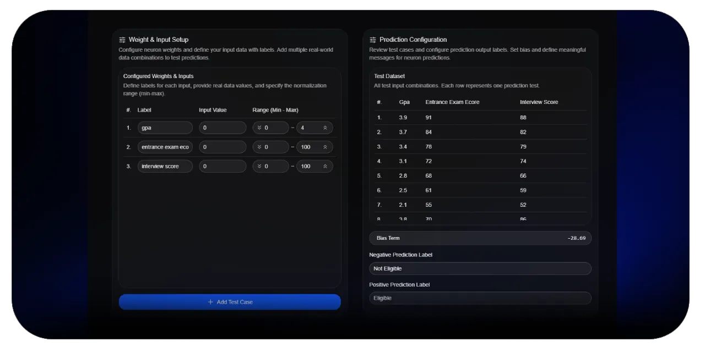

[MonoNeural Document](https://github.com/dulanjayabhanu/mononeural#2-artificial-neuron-tester) / Artificial Neuron Tester

 

    

 

# Artificial Neuron Tester

The Artificial Neuron Tester is the evaluation environment of MonoNeural where trained neuron configurations are used to generate predictions on new or unseen data. This tool represents the practical application phase of the learning process, where users can observe how a trained neuron behaves outside of its training dataset.

Unlike the training environment, the tester focuses on inference and interpretation. Users provide input values and apply previously learned weights and bias configurations to generate activation outputs. These outputs are then translated into meaningful prediction results using configurable thresholds and labels.

The tester is designed to help users understand how machine learning models generalize learned patterns and apply them to new situations.

 

### 1. Weight and Input Setup

This section allows users to define or import neuron parameters before testing begins. Users can either manually configure weights and inputs or load previously trained configurations from the trainer module.

Each input is associated with a corresponding weight, which determines its influence on the final prediction. This mapping helps users understand how individual features contribute to the decision-making process of the neuron.

The setup phase ensures that the testing environment accurately reflects the trained model configuration before evaluation begins.

 

### 2. Prediction Configuration

Prediction configuration defines how raw numerical outputs from the neuron are interpreted. Since the neuron produces an activation value, this section allows users to map those values into meaningful labels.

Users can define lower and higher threshold messages that represent different outcomes. For example, values below a threshold may represent a negative prediction, while values above it represent a positive prediction.

This abstraction helps users understand how continuous numerical outputs are converted into categorical decisions in real-world machine learning systems.

 

### 3. Testing Controls

The testing controls section provides interactive tools to execute predictions and manage test cases. Users can run individual predictions or execute multiple test scenarios in sequence.

This section also includes controls for resetting the testing environment, allowing users to clear previous results and start fresh evaluations.

The goal of this section is to provide a controlled environment for experimentation and repeated testing.

 

### 4. Results Table

The results table displays the output of all executed test cases in a structured format. Each row contains the input values, computed activation output, and final prediction label.

This allows users to analyze how different input combinations affect the neuron's decision-making process. It also provides a clear comparison between expected behavior and actual model output.

By reviewing results in tabular form, users can identify patterns and evaluate the consistency of the trained neuron.

 

[Back To Main Document](https://github.com/dulanjayabhanu/mononeural#2-artificial-neuron-tester)