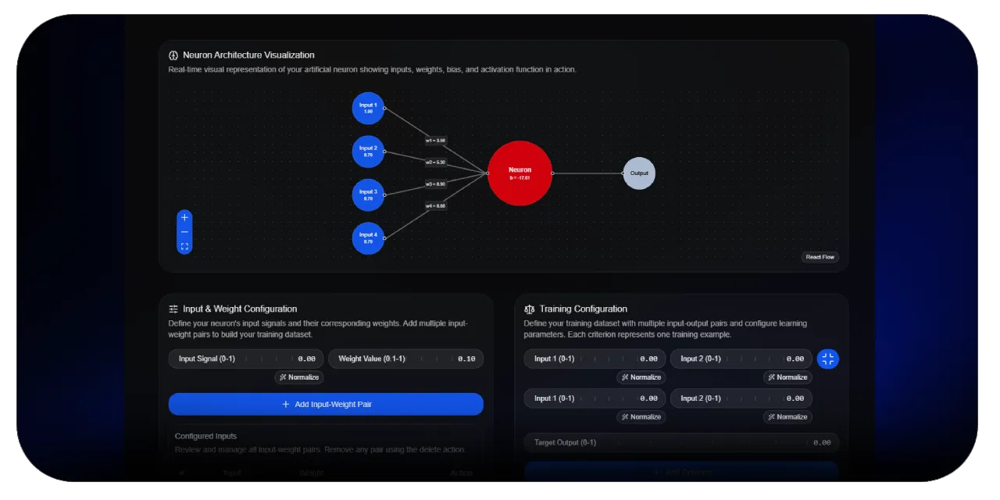

[MonoNeural Document](https://github.com/dulanjayabhanu/mononeural#1-artificial-neuron-trainer) / Artificial Neuron Trainer

 

    

 

# Artificial Neuron Trainer

The Artificial Neuron Trainer is the central component of MonoNeural and represents the starting point for building an artificial neuron from scratch. It is designed to simulate the full learning process of a neuron, from initial configuration through iterative training and parameter optimization.

This tool allows users to define the structure of a neuron in a highly interactive environment. Instead of writing code or implementing mathematical formulas manually, users configure inputs, assign weights, and set bias values through a visual interface. Each configuration directly influences how the neuron behaves during training and prediction.

The trainer is built to replicate a simplified version of how machine learning models learn from data. Users provide structured training data, and the system adjusts internal parameters over multiple cycles to reduce prediction error. This creates a practical understanding of how learning algorithms improve performance over time.

 

## Overview

The overview section of the trainer provides a high-level understanding of how the system operates. It explains how inputs flow into the neuron, how weights influence each input, and how bias contributes to the final output.

This section is intended to help users form a mental model of neuron computation before interacting with the system. By understanding the flow of data and transformation steps, users can better interpret the results generated during training.

 

### 1. Neuron Architecture Visualization

The neuron architecture visualization provides a real-time graphical representation of how inputs, weights, and bias interact within the neuron. Each input connection is visually mapped to its corresponding weight, allowing users to see how data flows through the system.

This visualization helps users understand the relationship between individual inputs and their contribution to the final output. It also makes it easier to identify how changes in parameters affect the overall structure of the neuron.

The goal of this section is to transform abstract mathematical relationships into a visual and intuitive format that can be easily understood without technical background knowledge.

 

### 2. Input and Weight Configuration

This section allows users to define the core parameters of the neuron. Inputs represent the raw data points, while weights determine the importance of each input in the final computation.

Users can dynamically add or modify inputs and assign meaningful labels to each one. This helps simulate real-world scenarios where data features have specific meanings, such as attendance, performance scores, or behavioral indicators.

Weights are configurable values that influence how strongly each input contributes to the final result. Adjusting these values allows users to observe how different configurations impact prediction behavior.

 

### 3. Training Configuration

The training configuration section defines how the neuron learns from data. Users can specify training criteria, learning rate, and the number of training cycles.

Training criteria define the expected output behavior for given inputs, allowing the system to measure prediction accuracy. The learning rate controls how aggressively the neuron adjusts its parameters during training, while training cycles determine how many iterations the learning process will run.

This section introduces the concept of iterative optimization, where the neuron gradually improves its performance over multiple training steps.

 

### 4. Ready to Train

Once all configurations are set, the system enters a ready state where the neuron is fully prepared for training. This stage acts as a final validation point to ensure that all required parameters are properly defined.

It gives users a clear checkpoint before execution begins, reinforcing the importance of structured setup in machine learning workflows.

 

### 5. Training Summary and Progress

During training, users can observe real-time updates showing how the neuron is performing. This includes changes in error rates, adjustments to weights, and overall progress across training cycles.

The summary provides a clear view of how the model evolves over time, helping users understand the relationship between training iterations and performance improvement.

 

### 6. Parameter Evolution Chart

The parameter evolution chart visualizes how weights and bias values change throughout the training process. This allows users to see how the model converges toward an optimal configuration.

By observing these changes, users gain insight into how learning algorithms adjust internal parameters to improve prediction accuracy.

 

### 7. Trained Neuron Parameters

After training is complete, the final optimized weights and bias values are displayed. These parameters represent the learned state of the neuron and can be exported for use in the testing environment.

This section reinforces the concept that machine learning models are defined by learned parameters rather than static logic.

 

[Back To Main Document](https://github.com/dulanjayabhanu/mononeural#1-artificial-neuron-trainer)